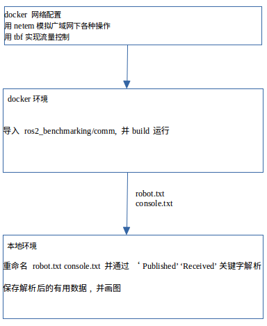

# ros2_benchmarking 思路解析    

docker网络配置(docker) -> docker内运行rclcpp程序(comm) -> 本机对docker内生成的log文件进行解析分析(python) -> 生成图表    

在Linux下, 可以通过tc工具来模拟各种网络情况. tc 可以用来控制 netem 的工作模式, 也就是说, 想要使用 netem, 则需要内核开启了 netem, 而且安装了 tc 工具.  


`netem` 可以用来模拟广域网下的延迟、丢包、重复、损坏和乱序等问题  
`tbf` 模拟流量控制  

然后每个轴上再从以下四个方面评估:  
- lostPackets
- firstReceived
- throughput
- latency

|  | limit | delay | loss | duplication | corruption | reorder |
| ------ | ------ | ------ | ------ | ------ | ------ | ------ |
| lostPackets |
| firstReceived |
| throughput |
| latency |

以下为可选环境:  
ros1,ros2opensplice,ros2fastrtps,ros2connext,opensplice,ros1bridge

## 流程分解  




## 注意事项  
生成ros1镜像可以直接运行本项目提供的命令:  
```
cd ros2_benchmarking
./python/run.py --build ros1:base ros1:node
```
ros2镜像请不要使用本项目提供的dockerfile, 请联系 yue.hu@ninebot.com 索要已经构建好的 ros2:fastrtps, ros2:opensplice, ros2:connext 镜像.  

1. 构建ros2镜像过程需要源码安装, 参考 https://index.ros.org/doc/ros2/Installation/Dashing/Linux-Development-Setup/  
需要把 /ros2_benchmarking/comm/ros2node/messages 拷贝到 ros2镜像 /ros2_ws/src/ros2/common_interfaces/messages 目录下, 然后再 build ros2.  
2. linux 下的 tbf 命令实现限速测试(limit)   
   ex:```/sbin/tc qdisc replace dev INTERFACE root tbf rate 100kbit burst 32kbit latency 500ms```  
   linux 下的 netem 命令实现模拟广域网下的延迟(delay), 丢包(loss), 重复(duplication), 损坏(corruption)和乱序(reorder).  
   ex: ```/sbin/tc qdisc replace dev INTERFACE root netem loss 100%```
  


